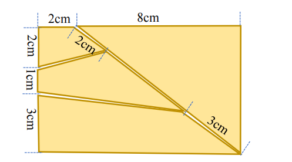

# 基础题四块拼图几何定义

## 1. 完成图与坐标

基础题固定使用 4 块拼图，完成后形成 `100 mm × 60 mm` 的横向矩形。以完成矩形
左上角为原点，`+X` 向右、`+Y` 向下，定义关键点：

| 点 | 坐标（mm） | 来源 |
|---|---:|---|
| A | `(0, 0)` | 左上角 |
| B | `(20, 0)` | 上边 2 cm 分点 |
| C | `(100, 0)` | 右上角 |
| D | `(100, 60)` | 右下角 |
| E | `(0, 60)` | 左下角 |
| F | `(0, 30)` | 左边 2 cm + 1 cm 分点 |
| G | `(0, 20)` | 左边 2 cm 分点 |
| P | `(36, 12)` | 对角线 `B-D` 上距 B 20 mm |
| Q | `(76, 42)` | 对角线 `B-D` 上距 D 30 mm |

`B-D` 是 `60-80-100 mm` 直角三角形的斜边，因此 `B-P=20 mm`、
`P-Q=50 mm`、`Q-D=30 mm`。图中未单独标注的 P、Q 坐标由该比例唯一确定。

## 2. 四块模板

| 模板 | 顶点顺序 | 面积（mm²） | 关键边长（mm） |
|---|---|---:|---|
| 右侧三角形 | `B-C-D` | 2400 | 80、60、100 |
| 上部四边形 | `A-B-P-G` | 480 | 20、20、36.878、20 |
| 中部四边形 | `G-P-Q-F` | 1080 | 36.878、50、76.942、10 |
| 下部四边形 | `F-Q-D-E` | 2040 | 76.942、30、100、30 |

四块面积之和为 `6000 mm²`。基础题求解先以顶点数、面积和刚体配准残差匹配这四个
模板，再输出图示布局中的目标位姿；轮廓与模板不一致时返回拒绝状态，不按其他题目的
宽尺寸范围猜测布局。

基础题轮廓筛选使用独立的最短边门槛。固定中部四边形的 `F-G` 边只有 `10 mm`，因此
不能沿用现场碎片的 `20 mm` 题面门槛；当前默认 `basic_min_piece_edge_mm=7.0`，之后仍须
通过四模板顶点数、面积比例和刚体配准残差门控。

基础题前景不再假定为白色。A4 透视校正后，在排除页边和中线的区域内动态估计当前
绿色纸面的 Lab 中位色，默认只计算 `a/b` 色度距离并取反得到前景候选。这可同时覆盖
强反光的亮金属面和偏暗金属面，并减少纸面亮度梯度造成的误检。背景色采样不稳定、
候选不是恰好 4 块或不满足固定模板拓扑时返回拒绝状态。

反光边缘产生的小缺口或倒角只在基础题初始角点候选阶段允许最多 `3.0 mm` 的
`approxPolyDP` epsilon 搜索；最终顶点仍来自完整轮廓的稳健直线拟合，并继续执行线 RMS、
最大残差、面积比例、边长和固定模板刚体配准门控。发挥题仍保留原独立参数。

平面旋转和镜像翻面是不同变换。若一块碎片只有镜像后才与模板对应，视觉输出
`BASIC_TEMPLATE_FLIP_REQUIRED:P...` 并拒绝生成放置坐标；当前五字段 X/Y/角度协议不能
表示翻面动作。只有所有碎片均能由平面刚体旋转匹配时，基础题才允许输出 `SOLVED`。

## 3. 默认防重叠间隙

目标规划默认使用 `target_piece_gap_mm=0.2`。求解器先保持每块模板的原始尺寸和姿态，
再沿所有公共接缝法向计算最小范数平移，使相邻模板之间形成 `0.2 mm` 名义间隙；不得
通过缩放或改变顶点来制造间隙。平移后的整体布局仍必须完整位于 A4 下半区安全边界内。

该数值描述视觉规划中的理想模板间隙。真实落位后的间隙、重叠和顶点距离必须由最终
场景重新测量；仅有规划结果不能证明机械执行精度。

## 4. 旋转角定义

串口五字段帧中的 `angle` 表示拼图块从当前姿态转到目标姿态所需的最短面内刚体
旋转角，而不是当前最长边角度：

- 从顶部向下观察，逆时针旋转为正；
- 从顶部向下观察，顺时针旋转为负；
- 范围归一化为 `[-180°, 180°)`；
- `+30` 表示还需逆时针旋转 30°，`-25` 表示还需顺时针旋转 25°；
- 正好 180° 时正负物理等价，协议统一表示为 `-180°`。

A4 图像坐标的 `+Y` 向下，代码会在输出控制角前显式翻转旋转符号。非对称三角形和
四边形使用求解器的完整刚体变换计算角度，不使用最长边的 `[-90°, 90°)` 半周角代替。
